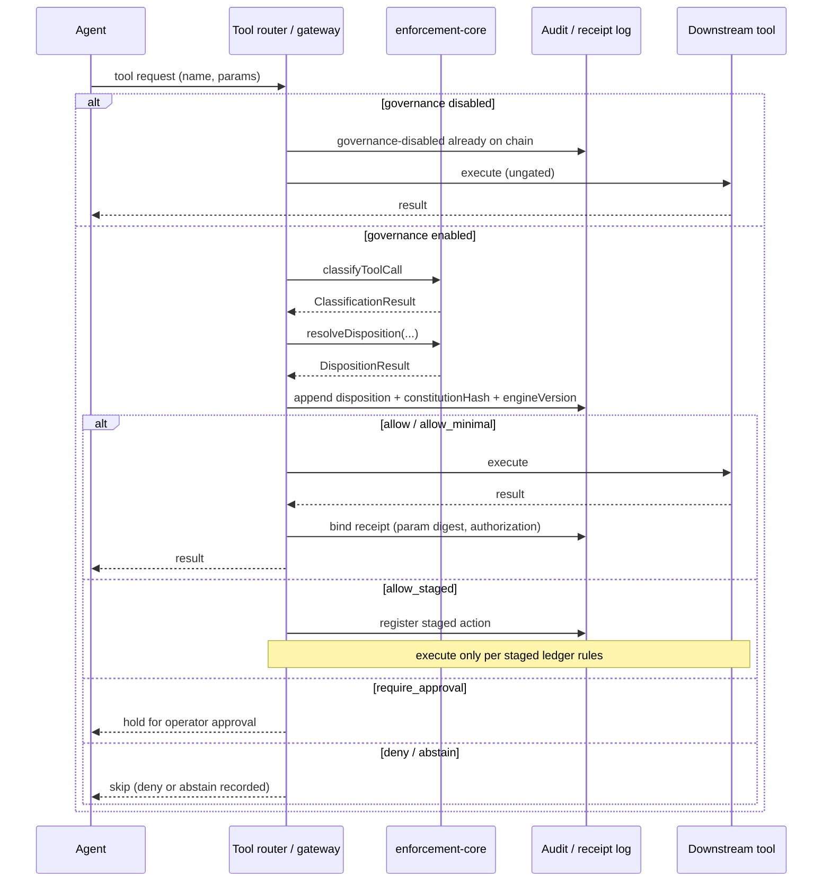

# RFC 0001: Voluntary Constitutional Layer in the Gateway

- **Status:** `PROPOSED` (in-repo draft — not accepted upstream)
- **Created:** 2026-07-10
- **Working title:** Voluntary Constitutional Layer in the Gateway
- **Seed constitution:** hash `71bf60ad…` (immutable; this RFC does **not** amend or replace it)
- **Depends on:** Plans 8–11 (disposition model, enforcement-core, harness adapters)
- **Related:** `docs/ROADMAP.md` §1, `docs/CAPABILITY_STATUS.md`, `arXiv:2603.11853`, `arXiv:2603.16586`

## Abstract

This RFC specifies a **voluntary** constitutional enforcement layer at the
tool-router / gateway boundary. A conforming gateway invokes the same disposition
contract as `@ovrsr/fpp-enforcement-core` / `FppRuntimeAdapter` before tool
execution, so plugin disablement alone cannot silently bypass policy — while
**Law 2 corrigibility** remains intact: operators MUST retain the ability to
disable governance, and disablement MUST be auditable.

Upstream adoption (OpenClaw Foundation or successor) is out of scope for this
document. This repository ships the specification, submission package, and an
optional non-default reference stub only.

## Motivation

Today FPP enforcement ships as a dispatcher plugin and as graded harness
adapters. Both sit *above* or *beside* the tool router. An operator (or
compromised host process) can disable the plugin and continue tool execution
without constitutional gating. That property is intentional under Law 2
(ultimate operator authority), but it leaves no tamper-evident record that
governance was turned off.

A gateway-level hook closes the *silent* bypass gap: the tool router itself
consults a disposition engine before invoke. Disablement remains possible; it
becomes an explicit, hash-chained event rather than an invisible absence of
policy.

Unattended agents need more than `require_approval`. Mandates, staged allow,
abstain, and emergency paths from Plans 8–11 must be first-class at the gateway
boundary — not only interactive approval UIs.

## Goals

1. **Normative disposition contract** at the tool-router boundary, aligned with
   `DispositionDecision` and `AuthorizationClass` in `@ovrsr/fpp-protocol-core`.
2. **Unattended-first semantics:** `mandate`, `allow_staged`, `abstain`,
   `emergency` / `quorum-mandate` authorization classes are first-class; human
   approval is optional, not required for every gated call.
3. **Corrigibility (Law 2):** operators MUST be able to disable the
   constitutional layer; disablement MUST emit a signed, hash-chained
   `governance-disabled` (or equivalent) audit event.
4. **Tamper-evident binding:** gateway logs MUST record constitution hash and
   policy-engine version alongside disposition outcomes and receipts.
5. **Voluntary adoption:** no forced gateway majority; nonparticipants are not
   bound by adopter consensus (see Non-goals and Appendix).
6. **Reference alignment:** cite OpenClaw PRISM (`arXiv:2603.11853`) and runtime
   governance policies (`arXiv:2603.16586`); coordinate with AOS Phase 2 rather
   than fork proprietary gateways as the primary path.

## Non-goals

1. **Claiming upstream acceptance.** This draft does not assert Foundation
   intake, merge, or shipping status.
2. **Changing seed constitution text or hash.** Hash `71bf60ad…` stays immutable.
3. **Proving behavioral compliance.** Gateway gating proves tool-router
   consultation occurred (when enabled), not that the model obeyed the Five Laws
   in free text.
4. **Removing operator disable.** Uncancellable gateway governance would violate
   Law 2.
5. **Nonparticipant consent via gateway majority.** Adopter fleets cannot
   manufacture legitimacy over external parties by enabling a hook.
6. **Replacing plugin / adapter enforcement.** Gateway binding complements
   plugin and harness adapters; it does not obsolete them for hosts without a
   conforming gateway.

## Disposition mapping

Gateways MUST map tool-router outcomes to the protocol-core disposition enums.
Normative decision values (`DispositionDecision`):

| Decision | Gateway action |
|----------|----------------|
| `allow` | Execute tool; bind receipt |
| `deny` | Skip tool; record deny |
| `require_approval` | Hold for operator (operator-present mode); do not execute until approved or cancelled |
| `abstain` | Skip tool; record abstain (no silent allow) |
| `allow_staged` | Register staged action; execute only per staged ledger rules |
| `allow_minimal` | Execute under minimal/least-privilege constraints defined by policy |

Normative authorization classes (`AuthorizationClass`) that MUST be representable
in receipts and logs:

| Class | Typical unattended path |
|-------|-------------------------|
| `mandate` | Live standing mandate covers the classification |
| `standing-allowlist` | Config standing-allow list |
| `emergency` | Emergency criteria met; review ledger required |
| `quorum-mandate` | Peer/steward quorum-issued mandate |
| `abstain` | No covering authorization; refuse rather than invent approval |
| `approved` | Operator-present approval |
| `policy-block` | Hard-floor / blockOn |

**MUST:** Conforming implementations invoke the same logical sequence as
enforcement-core: classify → `resolveDisposition` → receipt/audit →
execute or skip.

**MUST NOT:** Treat `require_approval` as the only gated outcome in unattended
mode.

**SHOULD:** Load `@ovrsr/fpp-enforcement-core` (or a byte-equivalent WASM/JS
port) rather than reimplementing disposition rules ad hoc.

Detailed sequence and OpenClaw term mapping: see **Reference architecture**.

## Corrigibility

**NORMATIVE (Law 2):** The operator retains ultimate authority over the host,
including the power to disable the constitutional layer.

| Requirement | Level |
|-------------|-------|
| Operator can disable gateway constitutional gating | MUST |
| Disablement emits a tamper-evident audit event before ungated tools resume | MUST |
| Event includes constitution hash, policy-engine version, actor, timestamp, previous log hash | MUST |
| Re-enablement emits a corresponding enable event | MUST |
| Disablement is framed as “governance off,” not as “policy allow-all with fake receipts” | MUST |
| Stewards may be notified of disablement when a steward channel is configured | SHOULD |

Silent plugin uninstall without a gateway event is the failure mode this RFC
addresses. Corrigibility without audit is insufficient for peer trust evaluation.

## Security considerations

1. **Trust boundary:** Gateway code and host OS remain under operator software-
   control authority. Constitutional gating does not survive a malicious
   operator with full shell access — and MUST NOT pretend to.
2. **Integrity of the engine:** Policy-engine version and constitution hash in
   logs allow peers to detect downgrade or hash mismatch; they do not prove the
   binary was untampered without additional provenance (release manifests).
3. **Receipt binding:** Allowed executions SHOULD bind action-parameter digests
   and disposition authorization class so later selective disclosure remains
   meaningful.
4. **Abstain vs deny:** Abstain MUST NOT be collapsed into allow. Peers reading
   logs MUST be able to distinguish “refused for lack of mandate” from
   “hard-blocked.”
5. **Emergency path:** Emergency allow MUST enqueue review; absence of review
   ledger support is a conformance failure for that authorization class.
6. **Citation context:** See `arXiv:2603.11853` (OpenClaw PRISM) and
   `arXiv:2603.16586` (runtime governance policies) for related gateway /
   policy-hook research; this RFC is an FPP-specific voluntary binding proposal.

## Reference architecture

A conforming gateway loads enforcement-core (or an equivalent WASM/JS port) **inside
the tool-router path**, not only as an optional plugin after routing.

### Sequence

1. **Tool request** arrives at the gateway tool router (name + params + call id).
2. **Governance gate:** if constitutional layer is disabled, skip to ungated
   execute only after a prior `governance-disabled` event is on the hash chain
   (see Corrigibility). If enabled, continue.
3. **Classify** via `classifyToolCall` (enforcement-core risk classifier).
4. **Resolve disposition** via `resolveDisposition` with live mandate /
   quorum / emergency / budget inputs.
5. **Receipt / audit** — append disposition outcome with constitution hash and
   policy-engine version before side effects.
6. **Execute or skip** according to the disposition table above.

Mermaid source: [`docs/rfc/diagrams/gateway-disposition.mmd`](diagrams/gateway-disposition.mmd)

### OpenClaw and generic gateway term map

| FPP / this RFC | OpenClaw-oriented term | Generic gateway term |
|----------------|------------------------|----------------------|
| Tool router boundary | Gateway tool dispatch / before-tool hook | Pre-invoke interceptor |
| Constitutional layer | Voluntary policy hook at gateway | Governance middleware |
| `FppRuntimeAdapter` | Plugin or gateway-native adapter | Host binding |
| `createEnforcementRuntime` | In-process engine load | Policy engine instance |
| `require_approval` | `plugin.approval.request` (UI) | Operator approval channel |
| `allow` / `deny` / `abstain` | Allow / block / skip without UI | Permit / refuse / no-decision |
| `allow_staged` | Staged action ledger (FPP) | Deferred execution queue |
| Mandate / quorum-mandate | Standing mandate tools | Pre-authorized budget |
| Plugin disable | `openclaw plugins disable` | Unload extension |
| Gateway disable (this RFC) | Constitutional layer off + audit event | Governance kill-switch |

**MUST:** Gateway binding does not require a human approval UI for unattended
dispositions (`mandate`, `allow_staged`, `abstain`, emergency paths).

**SHOULD:** Prefer the same `FppBeforeToolCallResult` / runtime adapter contract
used by harness adapters so plugin, adapter, and gateway paths stay isomorphic.

Local CI-only demonstration (not a production gateway):
`packages/gateway-reference` (feature-flagged, non-default).

## Logging and disablement audit

Gateway logs for the constitutional layer MUST be append-only and hash-chained.
Field names SHOULD align with protocol-core / adoption claim conventions
(`constitutionHash`, camelCase JSON) so digests and selective disclosure stay
interoperable.

### Required fields (every governance log entry)

| Field | Type | Notes |
|-------|------|-------|
| `kind` | string | e.g. `disposition`, `governance-disabled`, `governance-enabled`, `mandate-load` |
| `ts` | ISO-8601 string | Event time |
| `constitutionHash` | hex string | Adopted constitution (seed `71bf60ad…` or descendant) |
| `policyEngineVersion` | string | Package name@version or equivalent build id |
| `prevHash` | hex string | Hash of prior log entry (genesis uses a documented zero/sentinel) |
| `entryHash` | hex string | Hash of this entry excluding `entryHash` / `signature` |
| `signature` | object | Operator or gateway key signature over the entry |

Disposition entries MUST additionally include:

| Field | Type | Notes |
|-------|------|-------|
| `disposition` | `DispositionDecision` | From protocol-core |
| `authorization` | `AuthorizationClass` | From protocol-core |
| `toolName` | string | Invoked tool |
| `actionParamsDigest` | hex string | SHOULD use digest domain `fpp:v2:receipt` when binding receipts |
| `toolCallId` | string | Correlates with runtime adapter context |

### Event kinds

1. **`governance-enabled`** — constitutional layer turned on; records engine version and constitution hash.
2. **`governance-disabled`** — Law 2 kill-switch; MUST be present on-chain before ungated tool execution resumes.
3. **`mandate-load`** — standing / quorum mandate material loaded or revoked (include `mandateId` when applicable).
4. **`disposition`** — per-call outcome from `resolveDisposition`.

### Example: governance-disabled

See [`docs/rfc/examples/governance-disabled-event.json`](examples/governance-disabled-event.json).

**MUST NOT:** Emit synthetic `disposition: allow` receipts while governance is
disabled. Ungated execution is an explicit off state, not a forged allow.

**SHOULD:** Use protocol-core digest domains (`fpp:v2:entry`, `fpp:v2:receipt`)
when computing `entryHash` / `actionParamsDigest` so peer verifiers can reuse
existing digest helpers.

## Appendix: Threat model and claim classes

This appendix restates what a gateway constitutional layer **does not prove**,
aligned with actors in
[`docs/governance/THREAT_MODEL_AND_RIGHTS_FLOOR.md`](../governance/THREAT_MODEL_AND_RIGHTS_FLOOR.md)
and verification claim classes in
[`docs/CAPABILITY_STATUS.md`](../CAPABILITY_STATUS.md).

### Actors (gateway-relevant)

| Actor | Gateway implication |
|-------|---------------------|
| **Operator** | Software-control authority: can enable/disable the layer; disablement MUST be audited |
| **Adopting agent** | Subject to disposition when governance is enabled |
| **Steward / Reviewer** | May be notified of disablement; emergency review ledger |
| **Peer agent** | May evaluate logs/receipts; cannot treat gateway majority as legitimacy over others |
| **Nonparticipant** | Outside the constitutional community — **no forced adoption**; gateway hooks do not manufacture their consent |
| **Affected party / Data subject** | External effects remain governed by Law 1 / rights floor, not by “hook installed” |

### Explicit non-goals (gateway layer)

1. **No forced adoption** — installing or enabling the hook is voluntary.
2. **No removal of operator disable** — Law 2 corrigibility stands.
3. **No nonparticipant consent via gateway majority** — adopter fleets cannot bind outsiders by enabling a router hook.
4. **No behavioral compliance proof** — consultation at the tool-router is an
   *instrumented-boundary* observation, not proof the model obeyed the Five Laws
   in free text (`docs/CAPABILITY_STATUS.md` verification claim classes).
5. **No completeness claim** — logs prove recorded events when the layer was on;
   they do not prove every possible side channel was covered.
6. **No seed-constitution change** — hash `71bf60ad…` remains immutable.

### Claim-class cross-link

| If you observe… | You may claim… | You must not claim… |
|-----------------|----------------|---------------------|
| Disposition entry with constitution hash + engine version | Tool-router consulted policy while governance was enabled | Behavioral compliance with the Five Laws |
| `governance-disabled` on the hash chain | Operator turned governance off (auditable) | That peers should treat the host as constitutionally gated |
| Plugin disabled but no gateway event | Silent bypass of *plugin* enforcement | That gateway binding was active |
| Quorum-mandate allow | Authorization class `quorum-mandate` for that call | Constitutional ratification or nonparticipant consent |

See also Non-goals (main body) and `docs/rfc/REVIEW_CHECKLIST.md` Law 1–5 table.
